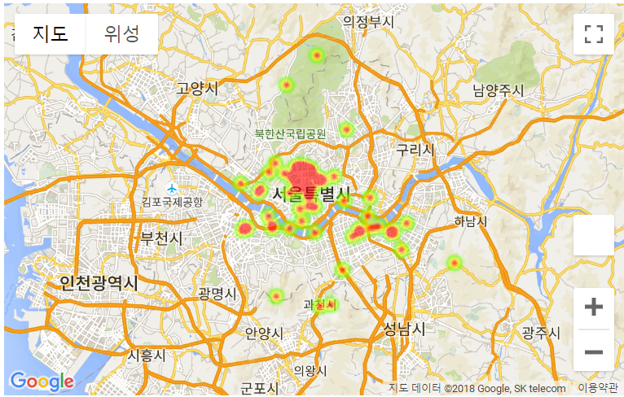

<h1 align="center">Sejong_ITIP</h1>
최근 미세먼지와 폭염 등에 대한 많은 이슈가 발생했습니다. 현재 갈만한 장소, 놀만한 장소를 추천해주는 앱들은 많으나 날씨와 미세먼지 현황을 고려하여 추천해주는 앱은 보이지 않습니다. 우리의 프로그램은 날씨와 거리를 기반으로 서울에서 갈만한 장소를 추천해줍니다.

> Demo Site : http://sejongitip.dothome.co.kr/

## API
<b>아래 API들을 받아야 프로그램을 실행할 수 있습니다.</b>  
> 날씨 : https://www.data.go.kr/dataset/15000099/openapi.do  
> 미세먼지 : https://www.data.go.kr/dataset/15000581/openapi.do  
> 구글맵 : https://cloud.google.com/maps-platform/?hl=ko  

## Data
<b>서울에 갈만한 장소를 정리합니다. 아래는 해당 데이터들의 Attribute value입니다.</b>  
> https://github.com/newhiwoong/Sejong_ITIP-/blob/master/Seoul_Place.csv

- Name : 장소의 이름을 기재합니다.
- Function : 장소의 대분류를 기재합니다.
- Details : 장소의 상세설명을 기재합니다.
- Day : 장소의 이용가능 시간을 기재합니다.
- Score : 장소에 대한 Google의 Score 기재합니다. 프로그램이 작동하며 거리, 날씨, 장소 분류 등에 맞게 점수를 갱신합니다.
- Indoor/Outdoors : 장소가 내부에 있는지 외부에 있는지 기재합니다.
- Longitude : 장소의 경도를 기재합니다.
- Latitude : 장소의 위도를 기재합니다.

### density of Data  



## 프로그램 작동 방식
1. 사용자의 현재 위치 및 날씨 정보 받기

2. 이용 시간에 따라 장소 필터링

3. 날씨 정보에 따라 장소 필터링

4. 사용자 주변 위치 위주로 필터링

5. 과정3에서 필터링한 정보가 적으면 주변으로 확대

6. 날씨, 거리 정보로 스코어 추가

7. 스코어를 기준으로 Random-roulette을 돌려서 추천 장소 선택

8. 다양한 장소 추천 크롤링한 정보들과 사진 등을 표시하며 몇 가지 장소를 추천

### 8. 다양한 장소 추천 크롤링한 정보들과 사진 등을 표시하며 몇 가지 장소를 추천


## 사용방법
<b>아래 준비 작업을 마친 후 프로그램을 다양한 방법으로 실행할 수 있습니다.</b>  

### 준비작업
```
def get_weather_data(longi, latit, key="......."): #부분에 당신의 날씨 API키를 입력하고 
service_key = '.......' # API키가 필요 
```

위 작업이 끝나면 이제 프로그램을 실행 할 수 있습니다.

### 실행
아래 코드를 실행하면 프로그램이 실행되고 장소를 추천해줍니다.  
```
python recommendation.py
```

가고 싶은 장소의 분류, 현재 위치의 구, 위도와 경도를 알고 있다고 가정한다면 아래와 같이 사용할 수 있습니다.  
```
python recommendation.py EatingFood 광진구 37.5505441 127.0722199
```

현재 구와 위도와 경도는 모르겠으나 가고 싶은 장소만 분류만 선택하고 싶다면 아래와 같이 사용할 수 있습니다.  
```
python recommendation.py EatingFood
```

가고 싶은 장소는 아래 분류를 보고 선택하면 됩니다.

### Web 사용법

웹은 아래 링크에 있는 파일들로 사용하면 됩니다.  
https://github.com/newhiwoong/Sejong_ITIP-/tree/master/Website/public

아래 문서 참고

https://github.com/newhiwoong/Sejong_ITIP-/blob/master/MDfile/website.md

### Function 분류
```
 #1.음식 먹기
    EatingFood = [
        '딤섬 전문 레스토랑',
        '음식점',
        '이탈리아 음식점',
        '일본 음식점',
        '중국 음식점',
        '패밀리 레스토랑',
        '프랑스 음식점',
        '한국식 소고기 전문 음식점',
        '한식 고기구이 레스토랑'
    ]

    #2. 마시기 
    Drinking = [ '바 & 그릴',
        '술집',
        '와인 바',
        '재즈바',
        '카페',
        '칵테일바',
    ]

    #####

    #3. 의미있는 곳
    MeaningfulPlace = ['문화유산보존지역',
        '불교사찰',
        '성당',
        '역사유적지',
        '역사적 명소'
    ]

    #4. 밖 인공,자연
    Outdoors = ['고궁',
        '관광명소',
        '관광지',
        '다리',
        '대광장',
        '타워',
        '공원',
        '국립공원',
        '산'
    ]

    #5. 앉아서 보고 듣기
    SeeAndHear=['공연예술 극장',
        '극장',
        '영화관',
        '자동차극장'
    ]


    #6. 구경하기 
    Watch =['미술관',
        '박물관'
    ]

    #7. 놀이공원 
    AmusementPark = ['놀이공원']  

    #8. 쇼핑하기
    Shopping=['쇼핑몰',
        '시가 전문점',
        '시장',
        '커피용품 판매점',
    ]

    #9. 운동하기
    Exercise = ['건강 센터',
        '스포츠 단지',
        '스포츠단지'
    ]

    #10. 노래방  
    Karaoke = ['노래방' ] #가까운
```


## 더 알아보기
<b>프로그램 제작에 필요한 크롤러와 API들의 사용법입니다.</b>  
> 크롤러 : https://github.com/newhiwoong/Sejong_ITIP-/blob/master/MDfile/crawling.md  
> 날씨 API : https://github.com/newhiwoong/Sejong_ITIP-/blob/master/MDfile/weather.md  
> 미세먼지 API : https://github.com/newhiwoong/Sejong_ITIP-/blob/master/MDfile/fine-dust.md  
> Web 이용 사용 : https://github.com/newhiwoong/Sejong_ITIP-/blob/master/MDfile/website.md
