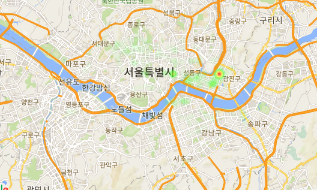

<h1 align="center">Sejong_ITIP</h1>
최근 미세먼지와 폭염 등에 대한 많은 이슈들이 발생했습니다. 현재 갈만한 장소, 놀만한 장소를 추천해주는 앱들은 많으나 날씨와 미세먼지 현황을 고려하여 추천해주는 앱은 보이지 않습니다. 우리의 프로그램은 날씨와 거리를 기반으로 서울에서 갈만한 장소를 추천해줍니다.

## API
<b>아래 API들을 받아야 프로그램을 실행할 수 있습니다.</b>  
> 날씨 : https://www.data.go.kr/dataset/15000099/openapi.do  
> 미세먼지 : https://www.data.go.kr/dataset/15000581/openapi.do  
> 구글맵 : https://cloud.google.com/maps-platform/?hl=ko  

## Data
<b>서울에 갈만한 장소를 정리합니다. 아래는 해당 데이터들의 Attribute value입니다.</b>  
> https://github.com/newhiwoong/Sejong_ITIP-/blob/master/Seoul_Place.csv

- Name : 장소의 이름을 기제합니다.
- Function :  장소의 대분류를 기제합니다.
- Details : 장소의 상세설명을 기제합니다.
- Day : 장소의 이용가능 시간을 기제합니다.
- Score : 장소에 대한 Google의 Score 기제합니다. 추천을 할 때에는 거리, 날씨 등에 맞게 점수를 갱신합니다.
- Indoor/Outdoors : 장소가 내부에 있는지 외부에 있는지 기제합니다.
- Longitude : 장소의 경도를 기제합니다.
- Latitude : 장소의 위도를 기제합니다.

#### Show density of Data  

## 개발 방법
1. 사용자의 현재 위치 및 날씨정보 받기

2. 이용시간에 따라 장소 필터링

3. 날씨 정보에 따라 장소 필터링

4. 사용자 주변위치 위주로 필터링

5. 과정3에서 필터링한 정보가 적으면 주변으로 확대

6. 날씨, 거리 정보로 스코어 추가

7. 스코어를 기준으로 Random-roulette을 돌려서 추천 장소 선택

8. 다양한 장소 추천 크롤링한 정보들과 사진등을 표시하며 몇 가지 장소를 추천

### 8. 다양한 장소 추천 크롤링한 정보들과 사진등을 표시하며 몇 가지 장소를 추천

## 다양한 사용방법
<b>아래 내용들은 수정하면 사진이 원하는 기상상태와 위치에 맞게 추천을 할 수 있습니다.</b>  
아래 -> 표시가 있는 항목은 해당 주석 및에 있는 변수들을 수정하면 되고 print 안에 있는 변수는 해당 변수를 수정하면 된다.  
- 미세먼지 가져오기 -> stationName = '광진구' # FIXME
- 날씨 및 미세먼지 변수 만들기 -> long = 127.073092, lati = 37.550208 
- MAIN CODE -> Longitude=12700, Latitude=3755
- print ("추출 시간   : ",dataTime)
- print ("미세먼지    : ",fine_dust)
- print ("초 미세먼지 : ",Ultrafine_dust)
- print ("기온        : ",weather_dict["T1H"])
- print ("강수량      : ",weather_dict["RN1"])
- print ("강수형태    : ",weather_dict["PTY"])
- print ("하늘상태    : ",weather_dict["SKY"])
- print ("낙뢰        : ",weather_dict["LGT"])
- print ("풍속        : ",weather_dict["WSD"])